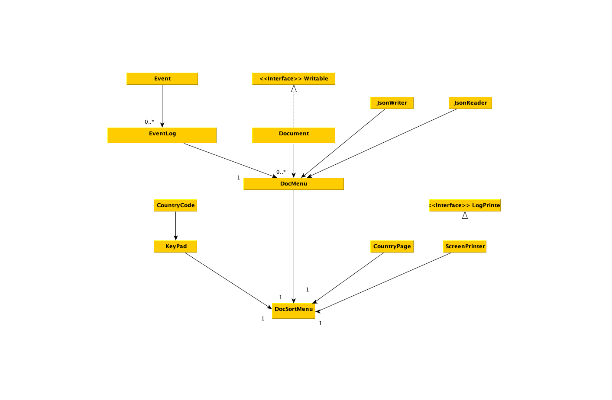

# International Document Sorter

## Phase 1

*User Story for Phase 1*:
- **As a user, I would like to** add documents
- **As a user, I would like to** remove documents
- **As a user, I would like to** switch countries
- **As a user, I would like to** see all documents for a country
- **As a user, I would like to** edit documents
- **As a user, I would like to** upload images of documents
- **As a user, I would like to** save my documents to file
- **As a user, I would like to** load my documents from file
- **As a user, I would like to** save my documents separate from each other depending on the country
  

*Task 2*:
- After much thought, I came to the decision that my project will be an application where you can input information about different legal documents from different countries and be able to access all that information organized. Ideally, I would like to make it so that there would be a map of the world where the user would be able to click on a country and a menu would appear with the documents that have been input earlier as well as the option to add or remove documents. This application would most likely be of use for people who travel a lot between countries or have multiple nationalities. That is partially how I came to this idea. When our TAs told us to make something of use to us, I started thinking about a form of organization and landed on this. Due to me being an international student, I do have legal documents both back home in Venezuela as well as in Canada and in the United States. It is a pain to have all these documents organized, so I thought this would be the perfect solution for it.

## Phase 4

*Task 2*

Fri Nov 26 04:25:26 PST 2021
Loaded saved documents

Fri Nov 26 04:25:26 PST 2021
Loaded saved documents

Fri Nov 26 04:25:34 PST 2021
Opened menu for CAN

Fri Nov 26 04:25:45 PST 2021
Document removed from CAN

Fri Nov 26 04:25:45 PST 2021
Document added to CAN

Fri Nov 26 04:26:21 PST 2021
Saved CAN to disc

Fri Nov 26 04:26:21 PST 2021
Saved LMW to disc

*Task 3*

The only refractoring that I would consider is unifying countryPage and countryCode since countryCode is pretty static, allowing me to simply implement that information to either that or to the keypad since there isn't much purpose apart from setting the limit of letters that a code can have 